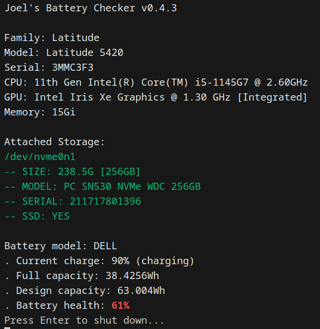

# Joel's Battery Checker
## Purpose
Derived from the [Arch Linux baseline install iso](https://github.com/archlinux/archiso/tree/master/configs/baseline), this bootable image was originally intended as a simple, rapid, vendor-agnostic method for a user to check the health of a laptop battery. In some circumstances the user only needs to plug in a USB stick, power on the machine, and wait. The project has since expanded to leverage `fastfetch` and `upower` packages to combine useful system specifications in a single, easily-accessible interface. 

## Usage
1. [Flash the .iso file](https://wiki.archlinux.org/title/USB_flash_installation_medium) directly onto a USB driver or other bootable medium. This file can be found in the [releases](https://github.com/RealArtsn/archiso-batterycheck/releases) section. 
2. With Secure Boot disabled, one-time boot to the medium containing the image. The machine will likely indicate if Secure Boot is blocking the boot sequence. Secure Boot can typically be toggled in the EFI/BIOS settings. 
3. Once the boot sequence has begun, wait for the Linux operating system to initialize and print out specifications. Press Enter to shut down when done.